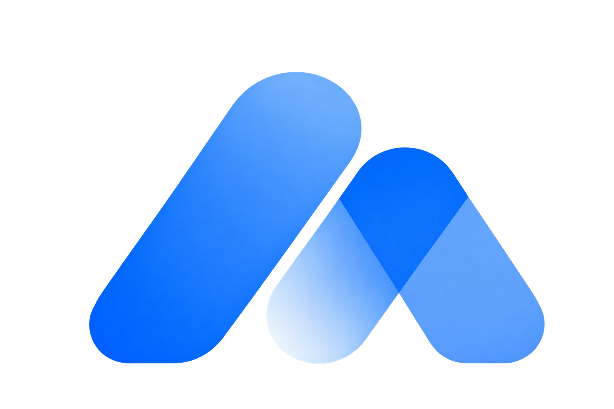
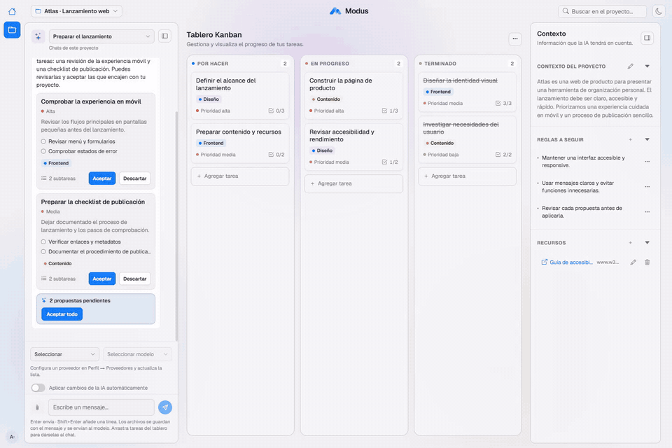
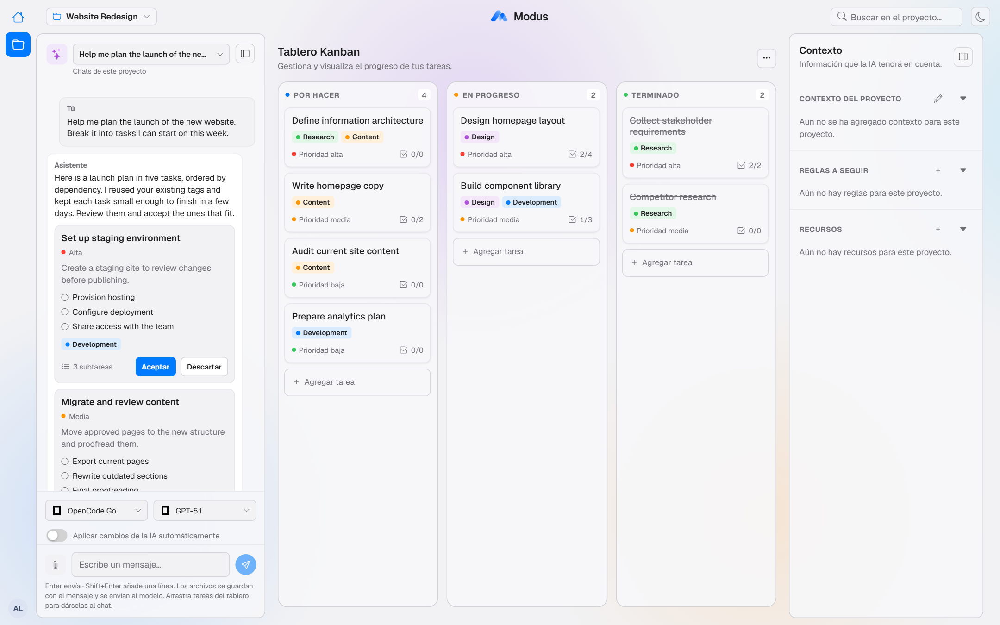
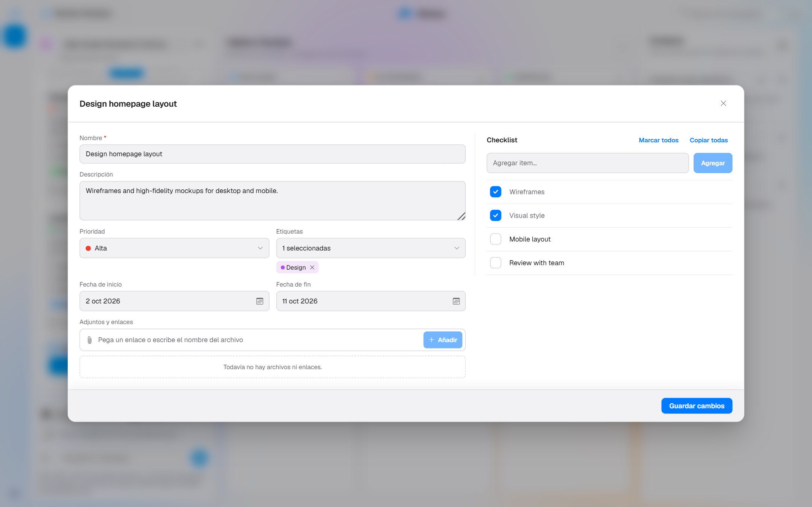
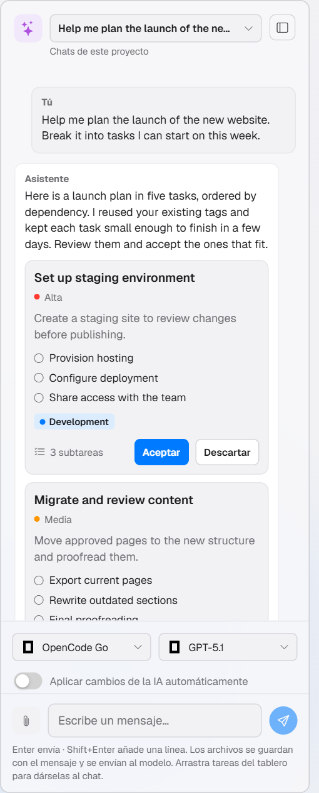
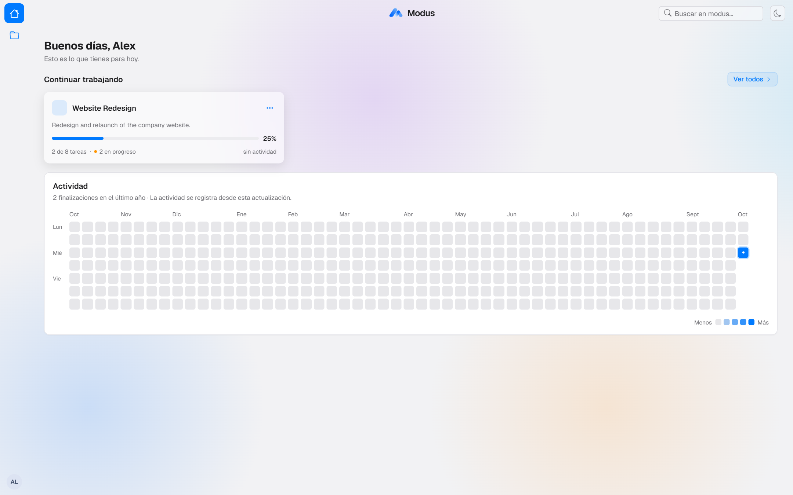
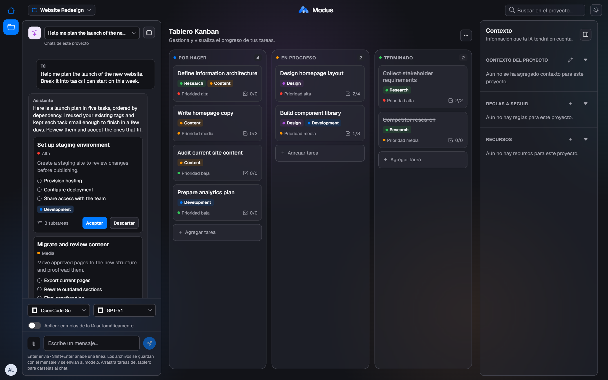
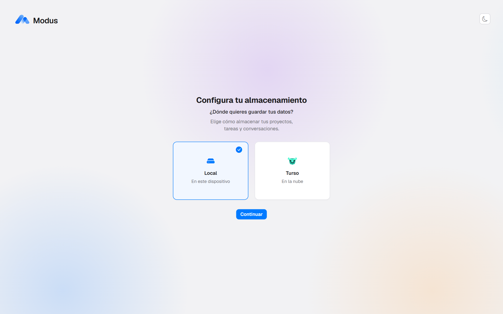
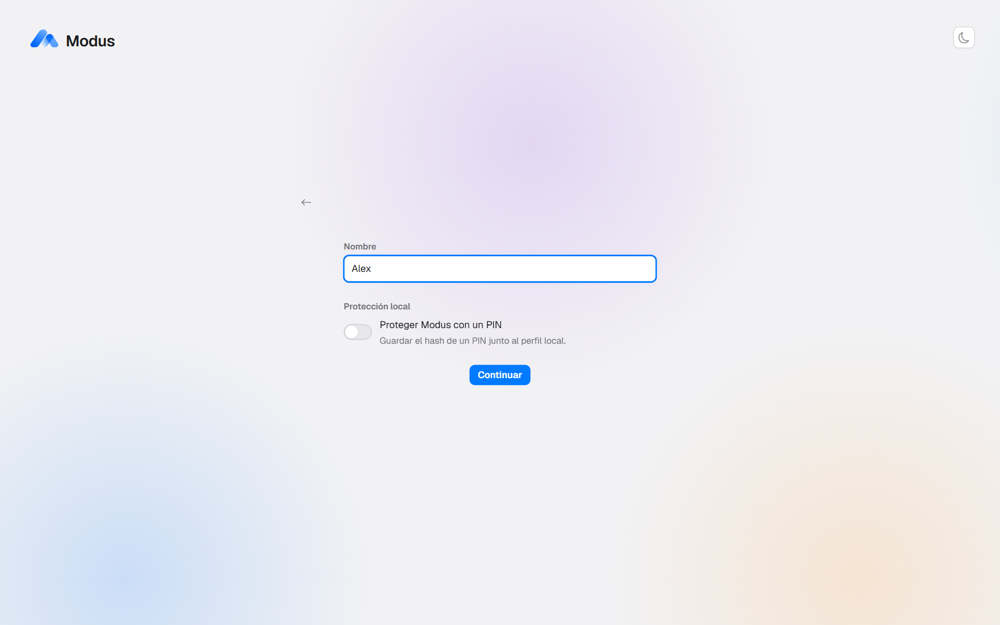
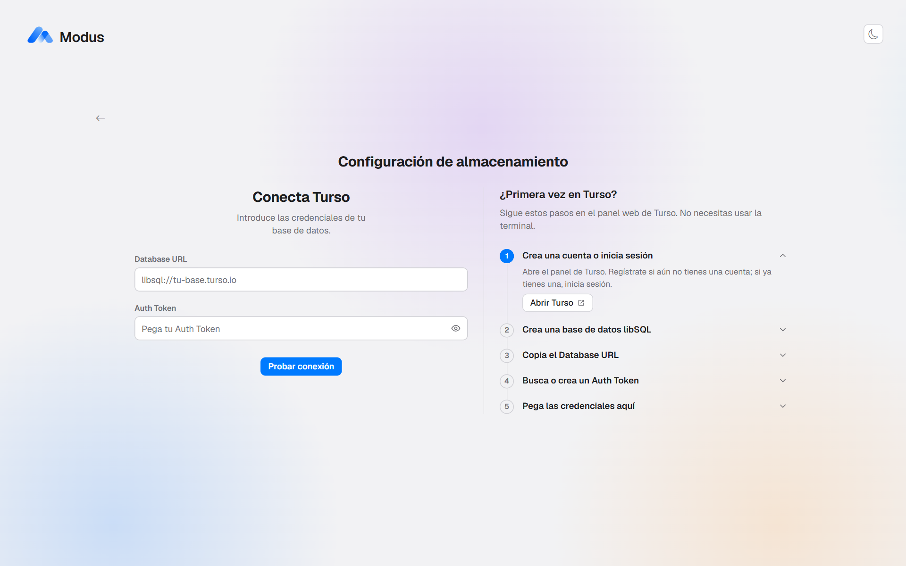

<div align="center">
  

  # Modus

  **Plan projects, manage tasks and work with an AI assistant that proposes — and you approve.**

  <p>
    <a href="#getting-started">Getting started</a> ·
    <a href="docs/guia-tecnica.md">Technical guide</a> ·
    <a href="https://github.com/Alexanderjms/modus/issues">Issues</a>
  </p>

  <br />

  

  <sub>Walkthrough · <a href="docs/media/demo.mp4">Watch the full-quality video</a></sub>
</div>

<br />

##  Overview

Modus is a project workspace that combines a Kanban board, per-project context and an AI assistant in a single place. It is built for people who need to turn ideas into structured, trackable work without losing control over what changes.

The assistant reads the context of your project, suggests tasks, subtasks, tags and edits, and waits for your decision. **Nothing is applied until you accept it.**

| | Principle | What it means |
| --- | --- | --- |
|  | **Human in control** | Every AI proposal is reviewed before it reaches your board. |
|  | **Fast to structure** | Go from a rough idea to a complete task list in minutes. |
|  | **Your data, your machine** | Modus runs locally and stores data where you choose. |
|  | **Bring your own AI** | Connect the provider and model you already use. |

> **Note:** the application interface is currently in Spanish. The screenshots below reflect the current interface.

##  Features

###  Kanban board

Organize work across three columns — **To do**, **In progress** and **Done** — and move cards as work advances.

<p align="center">
  
</p>

Each task supports:

| | |
| --- | --- |
|  | Priority levels |
|  | Start and end dates |
|  | Color-coded tags, shared across the project |
|  | A checklist of steps with progress |
|  | Attached files and links |

<p align="center">
  
</p>

###  AI assistant with review

Each project has its own conversation. The assistant knows the project description, its rules, its existing tasks and your tags, so its suggestions fit the work you already have.

Proposals arrive as cards you can **accept** or **discard**. Responses stream in as they are written, and proposed tasks appear one by one. Accepting several proposals applies them to the board at the same time.

<p align="center">
  
</p>

The assistant can propose to:

| | |
| --- | --- |
|  | Create new tasks, with subtasks and tags |
|  | Rename a task or change its description, priority and dates |
|  | Add or remove tags |
|  | Add, complete or reopen checklist items |
|  | Move a task to another column |

Prefer a faster flow? Enable **automatic apply** and changes are applied as they arrive, with a one-click undo.

###  Web search

When a question needs outside information, the assistant can search the web and cite its sources. This requires a search API key, which you configure once in your profile menu.

###  Files in the conversation

Attach images, PDFs, text documents and spreadsheets to a message, or drag a task from the board into the chat to discuss it directly.

###  Home and activity

The home page lists your projects with their progress and shows a year-long activity grid of completed tasks.

<p align="center">
  
</p>

###  Light and dark themes

The interface follows your preference and adapts from large desktop screens to mobile widths.

<p align="center">
  
</p>

##  How it works

| Step | Action | Result |
| :---: | --- | --- |
| **1** | Create a project | A board and a conversation are ready. |
| **2** | Describe your goal to the assistant | It uses your project context to understand the work. |
| **3** | Review the proposals | Accept, discard or adjust each suggested task. |
| **4** | Track progress | Move cards across the board until the work is done. |

##  AI providers

Connect the account or API key of the service you prefer, then choose the model from the chat.

| Provider | Connection |
| --- | --- |
|  **ChatGPT** | Sign in with your ChatGPT account |
|  **OpenCode Go** | API key |
|  **Groq** | API key |
|  **DeepInfra** | API key |
|  **Amazon Bedrock** | API key |
|  **OpenRouter** | API key |

The board works fully without an AI provider.

##  Storage and privacy

Choose where your data lives the first time you open Modus.

<p align="center">
  
  
</p>

| | Option | Description |
| --- | --- | --- |
|  | **Local** | Data is stored in a database on your computer. An optional PIN protects access. |
|  | **Cloud** | Data is stored in a [Turso](https://turso.tech/) database that you own, with username and password sign-in. |

<p align="center">
  
</p>

- Modus runs on your own computer; it is not a hosted service.
- Provider keys are stored encrypted (Windows credential protection).
- Only the content needed to answer a request is sent to the AI provider you select.

##  Getting started

**Requirements:** Node.js 24 and pnpm.

```bash
git clone https://github.com/Alexanderjms/modus.git
cd modus
pnpm install
pnpm dev
```

Open **http://127.0.0.1:3000**, choose where to store your data, create your profile and add your first project.

For configuration details, cloud storage, provider setup, troubleshooting and architecture, see the [technical guide](docs/guia-tecnica.md).

##  Project status

Modus is under active development (version 0.1.0). Interfaces and behavior may change as the product evolves.

##  Support

| | |
| --- | --- |
|  | [Report a problem](https://github.com/Alexanderjms/modus/issues) |
|  | [Suggest an improvement](https://github.com/Alexanderjms/modus/issues/new) |
|  | [Technical guide](docs/guia-tecnica.md) |

<br />

<div align="center">
  <sub>Icons by <a href="https://lucide.dev">Lucide</a>.</sub>
</div>
