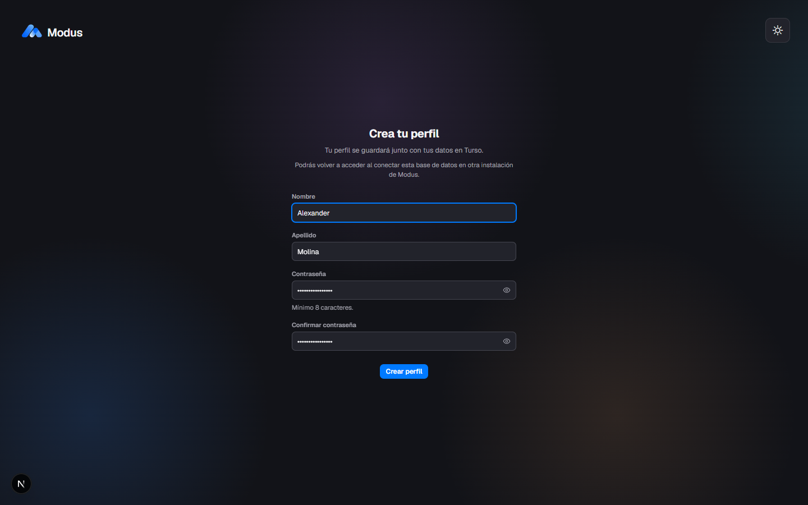
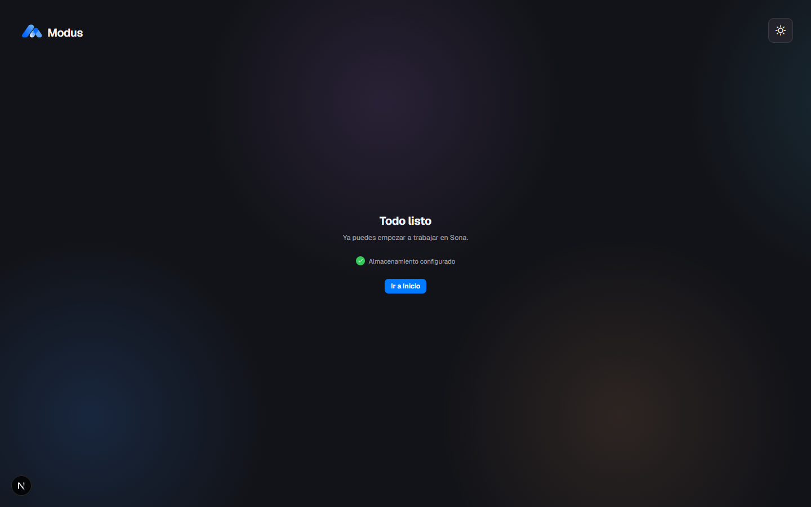

<div align="center">
  
  <h1>Modus</h1>
  <p><strong>Configuración inicial y onboarding con soporte para almacenamiento local y en la nube (Turso).</strong></p>

  <p>
    
    
    
    
  </p>
</div>

---

## 🌟 Acerca del Proyecto

**Modus** es una aplicación diseñada para ofrecer una experiencia de configuración de usuario rápida, accesible y estética. Permite a los usuarios elegir cómo y dónde gestionar sus datos desde el primer inicio: directamente en su dispositivo de manera local o sincronizados en la nube mediante **Turso** (libSQL).

---

## 📸 Vistas y Flujo de Onboarding

### 1. Selección de Almacenamiento

Elige entre almacenar tus proyectos de manera **Local** en tu dispositivo o en la nube mediante **Turso**.

<div align="center">
  
</div>

<br />

### 2. Opción A: Perfil Local

Configuración de nombre y activación de protección local mediante PIN de acceso.

<div align="center">
  
</div>

<br />

### 3. Opción B: Conexión con Turso

Formulario de credenciales (`Database URL` y `Auth Token`) acompañado por una guía interactiva paso a paso para usuarios no técnicos.

<div align="center">
  
</div>

<br />

### 4. Perfil Turso

Registro de nombre y credenciales protegidas para vincular los datos del perfil a la base de datos distribuida.

<div align="center">
  
</div>

<br />

### 5. Finalización

Confirmación de configuración completada y bienvenida al espacio de trabajo.

<div align="center">
  
</div>

---

## 🚀 Inicio Rápido

### Requisitos previos

- [Node.js](https://nodejs.org/) (versión 18 o superior recomendada)
- [pnpm](https://pnpm.io/) (`npm install -g pnpm`)

### Instalación

1. **Clonar el repositorio:**

   ```bash
   git clone https://github.com/tu-usuario/modus.git
   cd modus
   ```

2. **Instalar dependencias:**

   ```bash
   pnpm install
   ```

3. **Iniciar servidor de desarrollo:**

   ```bash
   pnpm dev
   ```

4. Abre [http://localhost:3000](http://localhost:3000) en tu navegador para ver la aplicación.

---

## 🛠️ Scripts Disponibles

- `pnpm dev`: Inicia el servidor de desarrollo en `localhost:3000`.
- `pnpm build`: Genera la versión de producción optimizada.
- `pnpm start`: Arranca el servidor listo para producción.
- `pnpm exec tsc --noEmit`: Comprobación de tipos en TypeScript.

---

<div align="center">
  <small>Construido con cuidado en los detalles de interfaz y experiencia de usuario.</small>
</div>
