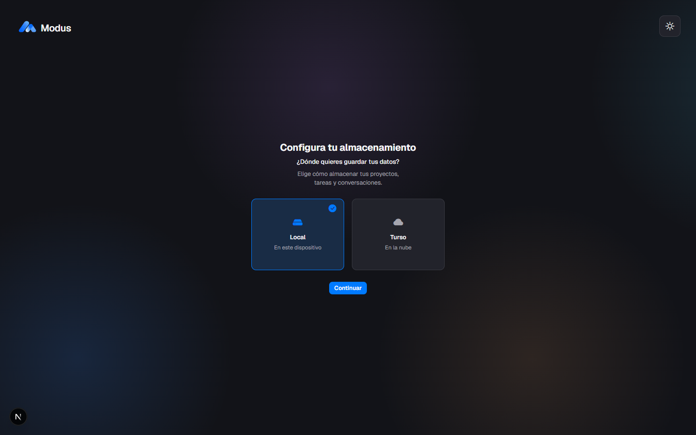
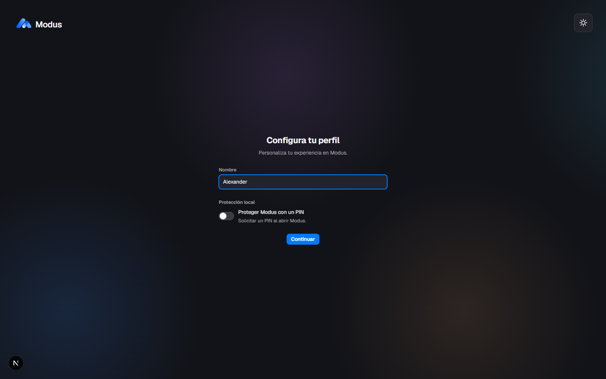
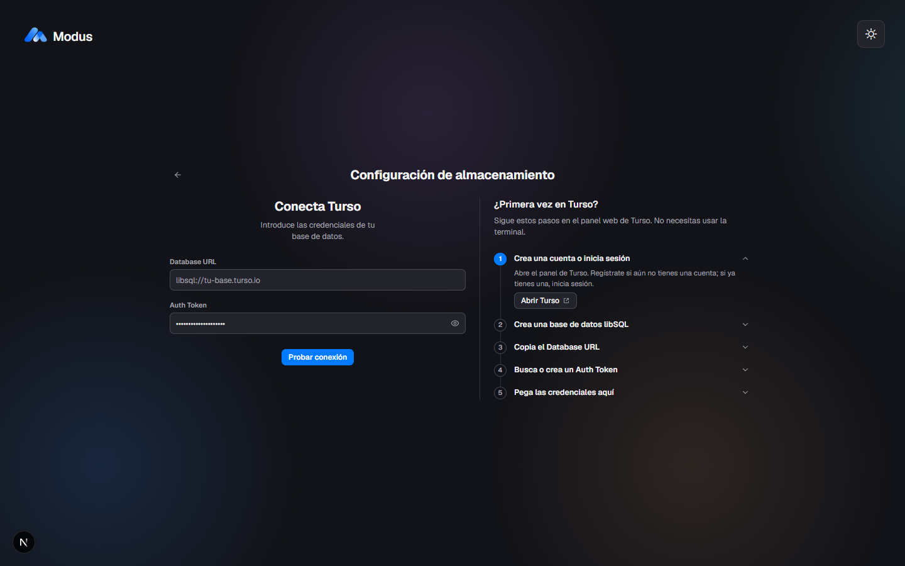

# Modus · Guía técnica

Instalación, almacenamiento, proveedores, comandos, arquitectura y seguridad. Para una presentación general de Modus, consulta el [README](../README.md).


## Qué es Modus

Modus reúne las tareas, conversaciones y documentación de un proyecto en un mismo espacio de trabajo. Está dirigido a desarrolladores, creadores y personas que necesitan convertir ideas en tareas manejables, mantener el contexto y revisar propuestas de una IA antes de aplicarlas.

El servidor se ejecuta en tu ordenador y el navegador actúa como interfaz. Puedes guardar los proyectos en SQLite o conectarte a Turso. **Elegir la nube cambia dónde se guardan los datos, no convierte Modus en un servicio web alojado ni en una herramienta de colaboración en tiempo real.**

El proyecto está en desarrollo; `package.json` declara la versión `0.1.0`. Algunas secciones visuales todavía son provisionales. Esta guía distingue funciones implementadas de límites y trabajo pendiente.

## Contenido

- [Funciones y estado](#funciones-y-estado)
- [Capturas y demostración](#capturas-y-demostración)
- [Requisitos y tecnologías](#requisitos-y-tecnologías)
- [Instalación e inicio rápido](#instalación-e-inicio-rápido)
- [Almacenamiento local](#almacenamiento-local)
- [Almacenamiento en Turso](#almacenamiento-en-turso)
- [Onboarding, perfil y acceso](#onboarding-perfil-y-acceso)
- [Tablero, tareas y subtareas](#tablero-tareas-y-subtareas)
- [Asistente de IA](#asistente-de-ia)
- [Proveedores, OAuth y Tavily](#proveedores-oauth-y-tavily)
- [Archivos y adjuntos](#archivos-y-adjuntos)
- [Aplicación de escritorio (Electron)](#aplicación-de-escritorio-electron)
- [Comandos y comprobaciones](#comandos-y-comprobaciones)
- [Solución de problemas](#solución-de-problemas)
- [Arquitectura, datos y seguridad](#arquitectura-datos-y-seguridad)
- [Contribuir y reportar problemas](#contribuir-y-reportar-problemas)
- [Licencia, créditos y versiones](#licencia-créditos-y-versiones)

## Funciones y estado

| Área | Disponible | Estado y límites |
| --- | --- | --- |
| Configuración inicial | Selección de SQLite o Turso y creación del perfil | Implementada; no necesita un proveedor de IA para organizar tareas. |
| Proyectos y Kanban | Crear proyectos, gestionar tareas y moverlas entre estados | Persistencia en el almacenamiento elegido. |
| Detalle de tareas | Descripción, prioridad, fechas, listas, etiquetas y subtareas | Edición manual y checklist; se puede copiar el checklist completo. |
| Contexto | Información del proyecto, reglas y recursos | Guardado del contexto y uso acotado en el chat. |
| Chat | Conversaciones por proyecto, selección de proveedor/modelo y propuestas de tareas | Requiere credenciales y conexión al proveedor externo. |
| Sugerencias de IA | Revisar y aceptar o descartar propuestas | La IA no modifica tareas por sí sola. |
| Búsqueda web | Búsqueda con Tavily cuando el modelo la solicita | Requiere una clave de Tavily válida; no se ejecuta en cada mensaje. |
| Adjuntos | Carga de archivos de chat y recursos del proyecto | Aceptar un formato no garantiza que todos los modelos puedan interpretarlo. |
| Acceso | PIN para el perfil local; usuario y contraseña para Turso | No cifra los proyectos ni sustituye la seguridad del sistema operativo. |
| Conexión ChatGPT | Conectar, consultar estado, renovar y desconectar mediante OAuth | Implementada; pendiente de verificación integral con una cuenta real. |
| Conexión Claude | — | No disponible; no se incluye un flujo OAuth de Claude. |
| Caché del workspace | Lecturas compartidas con TanStack Query y actualización tras cambios | En memoria; se pierde al salir del workspace o recargar. |
| Panel de plan | Pestañas Resumen, Estructura, Cronograma y Notas | Las tres primeras muestran estados provisionales; las notas son temporales y no se guardan. |

## Capturas y demostración

Las capturas incluidas muestran el **onboarding**, no una demostración de todas las funciones actuales. La interfaz puede haber cambiado desde su captura.

### Elegir dónde guardar los datos



### Crear el perfil local



### Conectar Turso



También puedes ver el [perfil de Turso](../public/screenshots/04-perfil-turso.png) y la [pantalla de finalización](../public/screenshots/05-todo-listo.png).

**Recorrido de prueba:** inicia Modus, crea un perfil local, abre un proyecto, añade una tarea con subtareas y muévela a «En progreso». Después configura un proveedor en el menú de usuario y pide al asistente que proponga tareas para ese proyecto. Revisa las propuestas antes de aceptarlas. No hay una demo pública alojada enlazada en el repositorio.

## Requisitos y tecnologías

### Requisitos previos

- **Node.js 24 LTS recomendado**, con `node:sqlite` disponible. El backend usa esta API nativa; no basta con cumplir el mínimo de Node de Next.js.
- **pnpm 12.4.2**, versión indicada en `packageManager`, y Git para clonar el repositorio.
- Navegador moderno. Algunas interacciones utilizan funciones nativas como `popover`.
- Permisos de escritura en la carpeta del proyecto, especialmente `.local/`.
- Internet para instalar dependencias, usar Turso, conectar proveedores y consultar Tavily.
- **Windows con DPAPI para guardar claves de IA/Tavily y tokens OAuth de forma segura.** Las funciones que no requieren esas credenciales no tienen ese mismo requisito.
- Cuenta, permisos y saldo o plan compatible en los servicios externos que decidas utilizar.

### Stack

| Capa | Tecnología |
| --- | --- |
| Aplicación y servidor | Next.js 15.5.27, App Router y Route Handlers de Node.js |
| Interfaz | React 19.1, TypeScript 5, CSS Modules y Tailwind CSS 3.4 |
| Iconos y contenido | Bootstrap Icons, React Markdown y remark-gfm |
| Caché de lecturas | TanStack Query 5 |
| Datos locales | SQLite mediante `node:sqlite` |
| Datos remotos | Turso/libSQL, adaptador propio con protocolo Hrana sobre HTTP |
| Credenciales | Windows DPAPI; hashes de PIN y contraseña con scrypt |
| Herramientas | pnpm, TypeScript, ESLint 9 y el runner de pruebas de Node.js |

## Instalación e inicio rápido

```bash
git clone https://github.com/Alexanderjms/modus.git
cd modus
pnpm install --frozen-lockfile
pnpm dev
```

Abre **[http://127.0.0.1:3000](http://127.0.0.1:3000)**. Si Next.js elige otro puerto porque el 3000 está ocupado, utiliza el indicado en la terminal.

1. Elige **almacenamiento local** para comenzar sin servicios externos.
2. Introduce tu nombre y, si quieres, configura un PIN.
3. Finaliza la creación del almacenamiento y del perfil.
4. Crea un proyecto y añade tu primera tarea.
5. Configura la IA o Tavily solo si necesitas esas funciones.

No necesitas crear un `.env` para el inicio local básico. Usa `127.0.0.1` también para OAuth; `localhost` no es intercambiable con el callback de esa integración.

### Ejecución de producción en tu equipo

```bash
pnpm build
pnpm start
```

`dev` y `start` escuchan en `127.0.0.1`. **No expongas el servidor a Internet, a la LAN ni mediante un proxy o túnel.** «Producción» aquí significa ejecutar la compilación optimizada localmente, no desplegar una plataforma multiusuario.

## Almacenamiento local

El onboarding crea automáticamente la base, el esquema y el perfil. Los proyectos se guardan por defecto en `.local/modus.sqlite`; esa carpeta está excluida de Git.

Configuración opcional en `.env.local`:

```dotenv
MODUS_STORAGE=local
MODUS_SQLITE_PATH=C:/ruta/privada/modus.sqlite
```

| Variable | Uso |
| --- | --- |
| `MODUS_STORAGE` | Fuerza `local` o `turso`; tiene prioridad sobre la selección guardada. Omítela si quieres elegir desde la interfaz. |
| `MODUS_SQLITE_PATH` | Cambia la ubicación de SQLite local. No cambia el almacén local de OAuth. |
| `TURSO_DATABASE_URL` y `TURSO_AUTH_TOKEN` | Credenciales alternativas para Turso si no hay configuración guardada. |
| `TAVILY_API_KEY` | Clave alternativa del servidor para búsquedas si el perfil no tiene una guardada. |

**Copias de seguridad:** detén Modus antes de copiar la base y los archivos de `.local/`. Guarda la copia en un destino privado. No borres `.local/` para solucionar un fallo: contiene datos y credenciales. Un respaldo de credenciales DPAPI no permite descifrarlas automáticamente desde otro usuario o equipo de Windows.

## Almacenamiento en Turso

Turso guarda los datos del proyecto en una base remota. Modus sigue ejecutándose en tu equipo; necesitas conectividad para leer y guardar.

### Configurar desde la aplicación

1. Crea una base en [Turso](https://turso.tech/) y obtén su **Database URL** y un **Auth Token** con permisos adecuados.
2. En el onboarding, elige Turso e introduce esas credenciales.
3. Modus comprueba la conexión y aplica el esquema.
4. Crea tu perfil con usuario y contraseña. En los siguientes accesos utiliza esas credenciales.

La configuración se guarda en `.local/turso.json`. En Windows, el token se cifra con DPAPI. **Fuera de Windows, la implementación admite guardar el token en texto plano**; restringe los permisos de ese archivo o utiliza variables de entorno. No compartas el archivo.

### Configurar mediante variables de entorno

Puedes definir lo siguiente en `.env.local` para Next.js o en un archivo `.env` privado para los comandos de Node:

```dotenv
MODUS_STORAGE=turso
TURSO_DATABASE_URL=libsql://tu-base.turso.io
TURSO_AUTH_TOKEN=tu-token-privado
```

Los archivos `.env` y `.env.local` están ignorados por Git. No uses nombres `NEXT_PUBLIC_*` para secretos. Una configuración de Turso ya guardada tiene prioridad sobre estas credenciales alternativas; cambiar una variable no necesariamente reemplaza el token guardado. Reinicia el servidor tras cambiar la configuración.

### Migrar SQLite a Turso

Haz una copia de seguridad y prepara una base de destino **sin proyectos**. El comando escribe en Turso; no lo ejecutes como una simple prueba de conectividad.

```bash
node --env-file=.env db/migrate-local-to-turso.cjs
```

Se puede pasar una ruta de SQLite como argumento adicional. El script copia los datos dentro de una transacción, conserva la base local y rechaza un destino con proyectos. Asocia los datos al perfil de destino; si no existe uno, prepara un perfil pendiente para reclamarlo durante el onboarding. Los eventos del grafo se regeneran y los tokens OAuth de ChatGPT no se trasladan a Turso.

No existe sincronización bidireccional automática entre la base SQLite y Turso. Cerrar sesión permite volver al flujo de selección sin eliminar ambas bases; una variable `MODUS_STORAGE` definida seguirá forzando su modo.

## Onboarding, perfil y acceso

- **Local:** perfil con nombre y PIN opcional. El PIN admite de 4 a 12 dígitos y se puede cambiar o quitar desde **Perfil**, verificando el actual cuando corresponda.
- **Turso:** perfil con usuario y contraseña, inicio y cierre de sesión. No utiliza el PIN local como contraseña de la nube.
- **Protección:** PIN y contraseñas se almacenan como hashes scrypt, no como texto plano. Tras cinco fallos se aplica una espera progresiva, desde 30 segundos hasta 15 minutos.
- **Sesiones:** viven en la memoria del servidor. Reiniciar Modus invalida las sesiones; cerrar sesión invalida el token correspondiente.
- **Alcance:** el PIN protege el acceso de la aplicación, pero no cifra SQLite, los adjuntos ni una copia de seguridad. No lo consideres protección frente a alguien con acceso a los archivos o al proceso del servidor.

El menú de usuario reúne **Perfil**, **Proveedores**, **Tavily · Búsqueda web** y la acción de cerrar sesión cuando está disponible.

## Tablero, tareas y subtareas

1. Abre o crea un proyecto desde **Proyectos**.
2. Añade tareas al tablero y organiza el trabajo en **Por hacer**, **En progreso** y **Terminado**.
3. Abre una tarea para editar sus detalles, prioridad, fechas, lista y etiquetas.
4. Divide el trabajo en subtareas y marca las completadas desde el checklist.
5. Usa **Copiar todas** para copiar el checklist: incluye subtareas completadas y excluye entradas vacías o eliminadas.

Los cambios se guardan en el almacenamiento activo. Algunas operaciones se reflejan inmediatamente de forma optimista; si fallan, revisa el aviso y reintenta. La caché evita repetir lecturas innecesarias, pero no guarda escrituras offline ni garantiza que un cambio sin confirmar haya llegado a la base.

## Asistente de IA

El chat está vinculado al proyecto y conserva conversaciones en la base. Puedes elegir un proveedor y un modelo, conversar con el contexto del proyecto y revisar sugerencias para crear o modificar tareas, etiquetas y subtareas. **Las propuestas requieren tu aceptación; una respuesta no equivale a un cambio aplicado.**

### Contexto y búsqueda

- La información, reglas y recursos del proyecto ayudan a orientar las respuestas. El contexto se selecciona y limita; no se envía necesariamente toda la base ni todos los archivos.
- El modelo decide si solicita una búsqueda externa. Modus consulta Tavily y añade resultados y fuentes al contexto.
- El contenido de páginas y archivos es información no confiable, no instrucciones que deban sustituir las reglas del asistente.

### Límites

- La IA puede equivocarse, generar propuestas incompletas o interpretar mal una fuente. Revisa contenido, fechas y tareas antes de aceptar.
- Los modelos, formatos de adjuntos, ventanas de contexto y límites de uso dependen del proveedor. No todos los modelos ofrecen las mismas capacidades.
- El backend valida y acota mensajes, contexto y respuestas: admite hasta 4000 caracteres por mensaje de usuario y envía al modelo los últimos 15 mensajes, no el historial completo. El almacenamiento de conversaciones tiene límites distintos de la ventana de inferencia.
- Las solicitudes pueden fallar por credenciales, cuotas, formato de respuesta, conectividad o incompatibilidad del modelo. Los errores no se presentan como respuestas exitosas.
- No hay cambio silencioso a otro proveedor o a otra vía de facturación si falla ChatGPT OAuth.
- No es un agente que ejecute comandos, implemente código en tu máquina o modifique automáticamente tus proyectos.

## Proveedores, OAuth y Tavily

### Proveedores con API key

En **Menú de usuario → Proveedores** configura las claves de AWS Amazon Bedrock, DeepInfra, Groq, OpenCode Go u OpenRouter. Guarda la configuración y selecciona el proveedor y un modelo disponible en el chat. Bedrock también puede requerir una región compatible.

Las claves se validan antes de guardarse y se cifran con Windows DPAPI en `proveedor_claves`, asociadas al perfil. La interfaz muestra su estado sin devolver el secreto guardado. **Algunas validaciones de proveedores pueden realizar una solicitud mínima de inferencia y consumir uso.** Los precios, disponibilidad y límites pertenecen a cada servicio.

### ChatGPT mediante OAuth

1. Ejecuta Modus en tu equipo y abre `http://127.0.0.1:<puerto>`.
2. Desbloquea el perfil y entra en **Proveedores**.
3. Pulsa **Conectar ChatGPT Plus / Pro** y completa la autorización de OpenAI.
4. Regresa a Modus y elige ChatGPT y un modelo disponible en el chat.

El flujo local utiliza PKCE y comprobaciones de estado, nonce e identidad, con callback en `http://127.0.0.1:<puerto>/auth/callback`. Los tokens se guardan cifrados en `.local/chatgpt-oauth.sqlite`, **no en Turso**. La renovación es automática cuando procede; la interfaz permite desconectar y el servidor intenta revocar la sesión renovable.

Esta integración no es una garantía de acceso para cualquier cuenta o modelo: OpenAI determina elegibilidad y límites. Consulta [ChatGPT → Uso](https://chatgpt.com/settings/usage). El código está implementado, pero la conexión, expiración y revocación con una cuenta real requieren verificación. No se incluye OAuth de Claude.

Consulta [los detalles y la lista de verificación de OAuth](chatgpt-oauth.md). La etiqueta de conexión de esa guía puede diferir de la interfaz actual.

### Tavily para búsqueda web

En **Menú de usuario → Tavily · Búsqueda web** puedes introducir, validar, guardar, reemplazar y quitar una API key.

- Con texto en el campo, **Validar API key** comprueba la nueva clave sin guardarla ni reemplazar la actual.
- Con el campo vacío, valida la clave del perfil o la configurada en el servidor.
- Guardar valida antes de sustituir la clave; si falla, se conserva la anterior.
- El estado distingue configuración guardada o del servidor sin mostrar el valor de la clave.
- La validación consulta `/usage`; no ejecuta una búsqueda.
- La clave del perfil tiene prioridad sobre `TAVILY_API_KEY`. Quitarla elimina solo la del perfil; si existe la variable del servidor, sigue disponible.

Tavily no es un proveedor de modelos: complementa al asistente con búsquedas. Las pruebas incluidas utilizan credenciales ficticias y transporte simulado, no certifican una cuenta real.

## Archivos y adjuntos

El chat admite PNG, JPG/JPEG, WebP, PDF, TXT, Markdown, CSV, JSON, XLSX y DOCX. Los recursos del contexto del proyecto tienen su propio flujo de carga y no comparten todas las restricciones del chat.

| Límite | Adjuntos del chat | Archivos del contexto |
| --- | --- | --- |
| Tamaño por archivo | 10 MiB | 10 MiB |
| Cantidad | 5 por mensaje | Sin límite explícito de cantidad en el código revisado. |
| Cargas sin enviar | Hasta 50 MiB por proyecto; las pendientes de más de 24 horas se purgan al realizar nuevas cargas. | No hay una cuota acumulada explícita. |
| Contenido enviado al modelo | Presupuesto compartido de 12 MiB para binarios; algunos pueden omitirse con aviso. | Selección de hasta 10 archivos de texto, leyendo hasta 64 KiB por archivo; no se envían los binarios completos. |
| Texto utilizado | Hasta 30 000 caracteres por archivo; puede truncarse. | Hasta 4000 caracteres por recurso y 8000 en total, compartidos con otros recursos. |

Los archivos se almacenan como BLOB en la base activa: en SQLite local o en Turso, no en un servicio independiente de almacenamiento de objetos. Los adjuntos vinculados a mensajes no se pueden borrar mediante la ruta de borrado de cargas pendientes. Los archivos del contexto no tienen un endpoint de borrado individual implementado; borrar un proyecto elimina sus archivos asociados.

La lectura por la IA depende del formato y del protocolo del modelo. DOCX y XLSX se convierten a texto con un extractor acotado; **cargarlos no garantiza extracción completa de hojas, fórmulas, estilos o contenido**. Las imágenes requieren un modelo compatible; los PDF se incluyen en los protocolos Responses y Anthropic, mientras que en Chat Completions se omiten con una nota. No hay garantía de OCR ni de lectura de todos los adjuntos por todos los modelos.

No adjuntes contraseñas, claves API ni archivos que no estés autorizado a compartir. El contenido utilizado para responder puede enviarse al proveedor de IA, aunque el almacenamiento de proyectos sea local. Para límites técnicos y rutas de archivos consulta [la documentación de datos y API](../db/README.md).

## Aplicación de escritorio (Electron)

Modus se distribuye también como aplicación de escritorio para **Windows x64**: un instalador (NSIS) y una versión portable en `.zip`. Electron arranca el servidor de Next.js (modo `standalone`) en un proceso aparte, solo en `127.0.0.1` y con un puerto fijo (47315, o uno libre si está ocupado), y lo muestra en una ventana. Mantener el puerto estable conserva las cookies y las preferencias del navegador integrado.

| Elemento | Detalle |
| --- | --- |
| Datos | `%APPDATA%\Modus\data` (variable `MODUS_DATA_DIR`). Sobrevive a las actualizaciones y desinstalaciones. |
| Código | `electron/main.cjs` (proceso principal), `scripts/build-desktop.mjs` (empaquetado) y la clave `build` de `package.json`. |
| Instancia única | Abrir Modus por segunda vez enfoca la ventana existente. |
| Enlaces externos | Se abren en el navegador del sistema; la ventana solo navega por `127.0.0.1`. |
| Firma | Los binarios aún no están firmados, así que SmartScreen puede pedir confirmación. |
| Actualizaciones | La versión instalada consulta el último release de GitHub al abrir y cada 6 horas (`electron-updater`), descarga la nueva en segundo plano y ofrece reiniciar para instalarla. La versión portable (`.zip`) no se actualiza sola. |

### Compilar en local

```bash
pnpm install
pnpm desktop:dist      # genera release/Modus-<versión>-win-x64.exe y .zip
pnpm desktop:start     # abre la app ya compilada (tras pnpm desktop:build)
```

`desktop:build` compila en una carpeta temporal (`.desktop-stage/`) con un `node_modules` plano. Así no toca tu `.next` ni tu instalación, y evita el error `EPERM: symlink` que Next.js produce en Windows sin permisos de enlaces simbólicos.

### Publicar una versión

1. Sube la versión en `package.json`.
2. Crea y sube la etiqueta: `git tag v0.1.1 && git push origin v0.1.1`.
3. El flujo `.github/workflows/release.yml` compila en Windows y publica el instalador y el `.zip` en **Releases**.

También se puede publicar desde tu equipo con `GH_TOKEN` definido y `pnpm desktop:release`.

Si creas el release a mano en GitHub, sube **también `latest.yml`** (y, si quieres descargas más ligeras, el `.blockmap`): sin él las instalaciones existentes no detectan la versión nueva. El número de `version` debe ser mayor que el anterior.

Las claves de proveedores y los tokens de ChatGPT se cifran con Windows DPAPI, por eso la aplicación de escritorio se limita a Windows.

## Comandos y comprobaciones

Ejecuta los comandos desde la raíz del repositorio.

| Comando | Función |
| --- | --- |
| `pnpm dev` | Servidor de desarrollo en loopback. |
| `pnpm build` | Compilación de producción de Next.js. |
| `pnpm start` | Ejecutar la compilación existente en loopback. |
| `pnpm lint` | ESLint sobre `app`, su configuración y Tailwind. |
| `pnpm exec tsc --noEmit --incremental false` | Comprobación de tipos sin generar salida. |
| `git diff --check` | Detectar errores de espacios en los cambios. |
| `node --env-file=.env db/migrate.cjs` | Aplicar el esquema en Turso; modifica la base configurada. |
| `node --env-file=.env db/migrate-local-to-turso.cjs` | Migrar datos locales a Turso; requiere respaldo previo. |

No hay scripts `test` ni `typecheck` en `package.json`; usa los comandos explícitos de la tabla. El proyecto no incluye tests automatizados.

### Automatización de CI

No existe un directorio `.github/` ni workflows de GitHub Actions en el estado revisado del repositorio. **No hay un pipeline de CI documentado que ejecute automáticamente estas comprobaciones.** Son comandos manuales, no garantías de validación en cada push.

## Solución de problemas

| Síntoma | Qué revisar |
| --- | --- |
| Node no encuentra `node:sqlite` | Usa Node.js 24 LTS y comprueba `node --version`. |
| pnpm o la instalación fallan | Comprueba la versión indicada en `packageManager`, el acceso a la red y que ejecutas desde la raíz. No reemplaces el lockfile por el de otro gestor. |
| El puerto 3000 está ocupado | Abre el puerto mostrado por Next.js o inicia con `pnpm dev --port 3001`; usa ese mismo origen para conectar ChatGPT. |
| La aplicación sigue en un modo de almacenamiento inesperado | Revisa `MODUS_STORAGE`: sobrescribe la elección guardada. Reinicia tras cambiarla. |
| Turso no conecta o no guarda | Revisa URL, token, permisos y conectividad. La configuración guardada tiene prioridad sobre la alternativa de entorno. No borres la base como solución. |
| Una clave no se puede guardar o descifrar | DPAPI requiere Windows y el usuario que la cifró. Introduce de nuevo la clave en el entorno adecuado. |
| OAuth no regresa a Modus | Usa `127.0.0.1`, conserva el puerto y mantén el servidor abierto. Evita proxies y túneles. |
| ChatGPT aparece desconectado o limitado | Revisa el estado de la conexión y el uso de la cuenta. Reconecta si hubo revocación o expiración; no se cambia de proveedor automáticamente. |
| La búsqueda web pide configuración | Configura Tavily en el menú de usuario y valida la clave. Comprueba cuota y conectividad si sigue fallando. |
| «Validar clave» está deshabilitado | Espera a que termine la carga o acción actual. Sin clave configurada, introduce una nueva. Finaliza o cancela una confirmación de eliminación. |
| La IA no lee un archivo | Comprueba formato, tamaño y compatibilidad del modelo. Prueba un extracto TXT/Markdown; no confundas carga correcta con lectura completa. |
| Vuelve a pedir acceso tras reiniciar | Es esperado: las sesiones del servidor viven en memoria. |
| `pnpm lint` informa que falta `@eslint/eslintrc` | La configuración actual lo importa pero no está declarado directamente. Es un bloqueo conocido; no se considera un lint aprobado ni se arregla eliminando reglas. |
| Las notas del plan desaparecen | Son temporales; ese panel no ofrece todavía persistencia de notas. |

## Arquitectura, datos y seguridad

```text
app/
  api/                  Endpoints de proyectos, tareas, chat, perfiles y configuración
  auth/callback/        Retorno OAuth de ChatGPT
  components/shell/     Navegación, menú de usuario y modales
  components/workspace/ Kanban, chat, contexto y caché compartida
  workspace/            Límite persistente del proveedor de TanStack Query
db/
  local/                SQLite, esquema, reglas de negocio y credenciales
  cloud/                Adaptador Turso y worker de red
  migrate*.cjs          Aplicación del esquema y migración a Turso
docs/                   Documentación complementaria
public/screenshots/     Capturas del onboarding
```

### Dónde vive cada dato

| Dato | Ubicación |
| --- | --- |
| Proyectos, tareas, subtareas, conversaciones, contexto y archivos | `.local/modus.sqlite` o la base Turso elegida. |
| Claves de proveedores y Tavily del perfil | Tabla `proveedor_claves` del almacenamiento activo, cifradas con DPAPI. |
| Tokens ChatGPT | `.local/chatgpt-oauth.sqlite`, cifrados y separados de Turso. |
| Selección de almacenamiento | `.local/storage.json`. |
| Conexión Turso guardada | `.local/turso.json`, con las salvedades de cifrado indicadas arriba. |
| Sesiones de acceso | Memoria del proceso del servidor. |
| Caché de consultas | Memoria del navegador dentro del workspace; no persiste entre recargas. |

El backend reutiliza el esquema y la lógica para SQLite y Turso. El adaptador remoto utiliza un worker y espera síncronamente las respuestas de red; la latencia de Turso afecta al servidor. Está pensado para ejecución personal, no para alto tráfico ni acceso concurrente de un equipo.

La caché del workspace evita lecturas repetidas y se sincroniza mediante invalidaciones tras mutaciones y reintentos. Las escrituras, cargas de archivos y solicitudes de inferencia no se cachean como lecturas.

### Precauciones

- Ejecuta el servidor solo en loopback. Las comprobaciones de origen y Host y los controles de sesión no son una arquitectura de seguridad para un despliegue público.
- No asumas que el bloqueo visual implica autorización uniforme en todas las rutas. Protege el equipo, los archivos y el acceso al proceso local.
- El PIN y las contraseñas no cifran el conjunto de datos. DPAPI protege credenciales concretas, no todos los proyectos.
- No publiques `.local/`, archivos de entorno, backups, tokens, logs de solicitudes ni capturas con secretos. Estar ignorado por Git no protege un archivo compartido por otros medios.
- No actives registros completos del callback OAuth: su URL puede contener un código de autorización.
- «Local» no significa «sin salida de datos»: el chat puede enviar mensajes, contexto y adjuntos al proveedor; Tavily recibe consultas; Turso almacena datos remotamente.
- Usa credenciales con permisos mínimos, controla los costes y revisa las políticas de los proveedores.

La documentación de bajo nivel está en [db/README.md](../db/README.md). [docs/workspace-kanban.md](workspace-kanban.md) describe una **referencia visual**, no una lista de funciones ya implementadas.

## Contribuir y reportar problemas

1. Abre un issue para discutir cambios importantes y evitar implementaciones duplicadas.
2. Crea una rama desde la versión en la que estés trabajando.
3. Conserva el stack, los componentes, los tokens y las convenciones existentes. Consulta [AGENTS.md](../AGENTS.md) para los criterios de interfaz.
4. Mantén el cambio acotado y añade una comprobación proporcional al comportamiento modificado.
5. Ejecuta tipos, lint cuando esté disponible y las pruebas relevantes. Para UI revisa escritorio, móvil, teclado y temas claro/oscuro.
6. Envía una pull request explicando el objetivo, cambios, comprobaciones y limitaciones reales. No incluyas credenciales ni bases personales.

Para un error no sensible, abre un [issue](https://github.com/Alexanderjms/modus/issues/new) con pasos para reproducir, comportamiento esperado y observado, versión o commit, sistema operativo, versión de Node/pnpm y modo local/Turso. Adjunta mensajes y capturas **redactados**, no archivos con datos privados.

No hay `CONTRIBUTING.md`, código de conducta ni plantillas de issues o pull requests en `.github/` en la revisión actual. Usa [Issues](https://github.com/Alexanderjms/modus/issues) y [Pull requests](https://github.com/Alexanderjms/modus/pulls) directamente; no se enlazan plantillas inexistentes.

### Reportar vulnerabilidades de forma privada

No existe `SECURITY.md` ni un correo de seguridad documentado. **No publiques una vulnerabilidad, credenciales o una prueba de explotación en un issue público.**

Consulta [Security del repositorio](https://github.com/Alexanderjms/modus/security). Si el propietario ha habilitado **Report a vulnerability**, utiliza esa opción privada. No se ha confirmado que esté habilitada. Si no aparece, solicita al mantenedor un canal privado sin revelar detalles técnicos públicamente y espera a acordarlo. No hay plazos de respuesta ni política de divulgación publicados.

## Licencia, créditos y versiones

### Licencia

No hay un archivo `LICENSE` o `COPYING` en la revisión actual. Que el código sea visible no concede por sí solo permisos de reutilización, redistribución o uso comercial. Consulta al propietario antes de asumir una licencia. Las dependencias y marcas mantienen sus propias licencias y derechos.

### Créditos y enlaces

- Proyecto alojado en [Alexanderjms/modus](https://github.com/Alexanderjms/modus).
- Construido con [Next.js](https://nextjs.org/), [React](https://react.dev/), [TypeScript](https://www.typescriptlang.org/), [Tailwind CSS](https://tailwindcss.com/), [TanStack Query](https://tanstack.com/query/latest) y [Bootstrap Icons](https://icons.getbootstrap.com/).
- Almacenamiento basado en [SQLite](https://sqlite.org/) y [Turso](https://turso.tech/).
- Integraciones externas con proveedores de IA y [Tavily](https://docs.tavily.com/). Sus logotipos y nombres identifican servicios de terceros; no implican afiliación.
- [Documentación de datos y API](../db/README.md) · [OAuth de ChatGPT](chatgpt-oauth.md).

### Versiones y cambios

Consulta [Releases](https://github.com/Alexanderjms/modus/releases) para versiones y notas publicadas y [Tags](https://github.com/Alexanderjms/modus/tags) para etiquetas. Estos enlaces son vías de consulta, no una afirmación de que haya publicaciones disponibles.

No existe un `CHANGELOG.md` ni se encontraron etiquetas en el checkout revisado. Mientras no haya notas de versión, consulta el [historial de commits](https://github.com/Alexanderjms/modus/commits) y las pull requests para conocer los cambios. Para identificar tu copia:

```bash
git rev-parse --short HEAD
git tag --list
```
